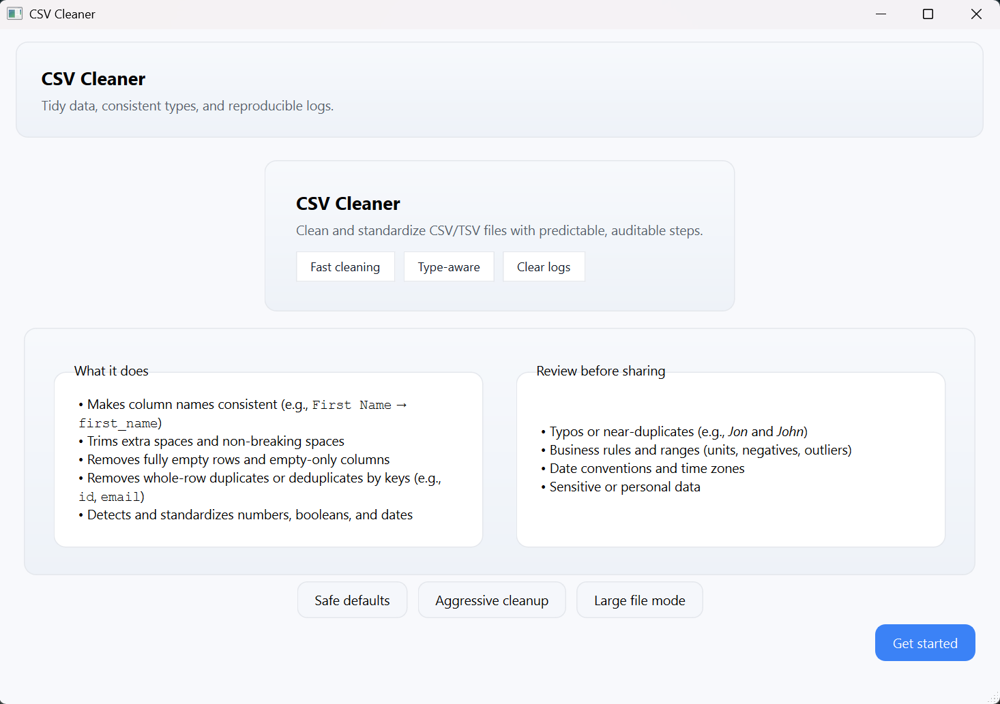
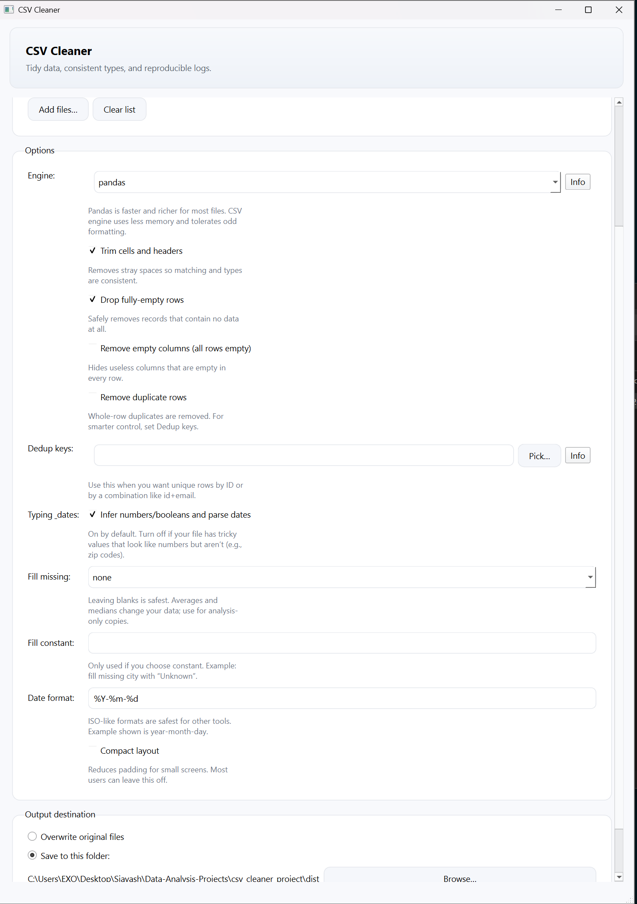

# CSV Cleaner GUI

This is the graphical interface (PySide6) for the CSV Cleaner project.  
It wraps the same cleaning logic from `main.py` with a user‑friendly multi‑page wizard.

---

## Features

- **Welcome page**: explains what the tool does, its limitations, and human‑review checklist.
- **File selection**: add one or more CSV/TSV files, view the list, clear/reset easily.
- **Options page**: configure all cleaning options, including:

  - Engine: **pandas** or **csv** (streaming)

  - Trim whitespace from text fields

  - Drop duplicate rows (with optional **dedup‑keys picker** to specify columns)

  - Standardize column names (snake_case)

  - Remove empty columns

  - Infer types (int, float, bool, date) with **date format override**

  - Missing‑value fill strategy: empty, constant, zero, mean, median, mode

  - Fill constant value (when chosen)

  - Compact layout toggle for the GUI itself

- **Progress page**: live progress display with current step and rolling list of updates.

- **Results page**: shows final output paths and full log text for each file.

- All cleaning functions are reused from `main.py` ensuring consistency.

---

## Usage

```bash
python gui_app.py
```

The app opens with a multi‑page wizard:

1. Welcome and checklist.

2. File picker (multi‑file).

3. Options configuration.

4. Progress display.

5. Results summary + logs.


---

## Packaging

To build a standalone executable:

```bash
pyinstaller CSV\ Cleaner.spec
```

or use the provided `build_exe.ps1` script (PowerShell).

---

## Screenshots

### Welcome Page


### Options Page


---
## Notes

- Review your cleaned files—this tool standardizes structure, but data context always requires human oversight.

- For stress testing, see `generate_max_payload.py` which generates huge messy CSVs.

- Both CLI (`main.py`) and GUI (`gui_app.py`) share the same cleaning core.
